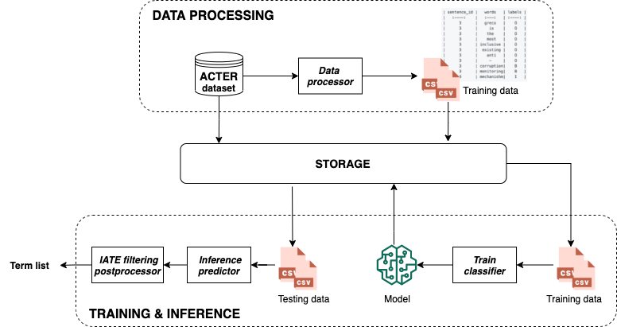

# Terminology Extraction

The references are summarized in [Summary.md](https://github.com/honghanhh/terminology-extraction/blob/paper_summary/references/Summary.md).

## ACTER data structures
```
ACTER
│   README.md
│   sources.txt
│
└───en
│   └───corp
│   |   └───annotations
│   |   |   |   corp_en_terms.ann
│   |   |   |   corp_en_terms_nes.ann
│   |   | 
│   |   └───texts
|   |       └───annotated
│   |       |   corp_en_01.txt
│   |       |   corp_en_02.txt
│   |       |   ...
│   |       |
|   |       └───unannotated
│   |           |   corp_en_03.txt
│   |           |   ...
|   |
│   └───equi (equivalent to "corp")
|   |
│   └───htfl (equivalent to "corp")
|   |
│   └───wind (equivalent to "corp")
|
└───fr (equivalent to "en")
└───nl (equivalent to "en")
```
The distributions of terms per domain per language are demonstrated in [data.exploration.ipynb](./eda/data_exporation.ipynb)

## Architecture

### 1. Preprocess data
We consider the problem as sequence labeling, which means the model returns a label for each token. To do that, the labels are converted into:
```
 B - word is the beginning word in term, 
 I - word is inside the term, 
 O - word is not inside the term. 
```
For examples:
```
... greco is the most inclusive existing anti - corruption monitoring mechanism ...
...   O    O  O   O       O       O       O   O     B          B          I     ...
```
- Input
```
    ./ACTER/en/*/*_en_terms.ann
    ./ACTER/en/texts/annotated/*
```
- Command
```
cd models
python prepocess.py
```
- Output

```
    ./preprocessed_data/train.pkl
```

### 2. Reformat training data
The training set contains the texts from 3 domains (corp, equi, wind), which is formatted as:

    | sentence_id |   words   | labels | 
    |   :----:    |   :---:   | :----: | 
    |      3      |   greco   |    O   | 
    |      3      |     is    |    O   | 
    |      3      |    the    |    O   | 
    |      3      |    most   |    O   | 
    |      3      | inclusive |    O   | 
    |      3      |  existing |    O   | 
    |      3      |    anti   |    O   | 
    |      3      |     -     |    O   | 
    |      3      | corruption|    B   | 
    |      3      | monitoring|    B   | 
    |      3      | mechanishm|    I   | 


- Input

```
    ./preprocessed_data/train.pkl
```
- Command
```
cd models
python format_data.py
```
- Output

```
    ./preprocessed_data/train.csv
```

### 3. Train model & evaluation

The worflow of our implementation:

- Models trained using SimpleTransformers on English dataset on Collab.
    - Variants of BERTs: BERT, RoBERTa, DistiledBERT
    - XLNet

We tested on both monolingual and bilingual pre-trained model and apply a pattern filtering as postprocessing step in inference.

- Train/val/test:
    - Train/val: texts from 3 domains (corp, equi, wind) with ratio of 80/20 
    - Test: heart failure texts

- Default settings: 
```
    adam_epsilon: float = 1e-8
    early_stopping_metric: str = "eval_loss"
    early_stopping_patience: int = 3
    eval_batch_size: int = 16
    learning_rate: float = 4e-5
    manual_seed: int = 2203
    max_seq_length: int = 512
    num_train_epochs: int = 4
    optimizer: str = "AdamW"
```

- Evaluation metrics: The final output is a list of lowercased terms and is compared with a correct term list to calculate Precision, Recall and F1-score.
    - Precision = TP/(TP+FP)
    - Recall = TP/(TP+FN)
    - F1-score = 2 * (Precision * Recall )/ (Precision+Recall)

<!-- 
- Results on heart failure dataset:
    - For English terms only

    |               Models                 | Precision | Recall  | F1-score |
    |               :----:                 |   :---:   | :----:  | :-----:  |
    |        BERT (bert-base-uncased)      | __77.36__ |  46.17  |__57.83__ |
    |        BERT (bert-base-cased)        |   72.77   |  42.91  |  53.99   |
    |       RoBERTa (roberta-base)         |   69.53   |  40.11  |  50.87   |
    |DistiledBERT (distilbert-base-uncased)|   75.53   |  44.05  |  55.65   |
    | DistiledBERT (distilbert-base-cased) |   67.44   |  44.22  |  53.42   |   
    |       XLNet (xlnet-base-cased)       |   70.39   |  41.59  |  52.29   | 
    |       __Baseline (TALN-LS2N)__       |   32.58   |__72.68__|   44.99  |  

    - For English terms with Named Entities (NEs)

    |               Models                 | Precision | Recall  | F1-score |
    |               :----:                 |   :---:   | :----:  |  :-----: |
    |        BERT (bert-base-uncased)      | __77.48__ | 44.99   | __56.93__|
    |        BERT (bert-base-cased)        |   71.27   | 42.13   |   52.96  |
    |       RoBERTa (roberta-base)         |   69.38   | 39.54   |   50.37  |
    |DistiledBERT (distilbert-base-uncased)|   75.23   | 44.29   |   55.76  |
    | DistiledBERT (distilbert-base-cased) |   67.98   | 42.79   |   52.52  | 
    |       XLNet (xlnet-base-cased)       |   72.62   | 38.68   |   50.48  |
    |       __Baseline (TALN-LS2N)__       |   34.78   |__70.87__|  46.66   |

- Analyze BERT model results:


<table class="tg">
<thead>
  <tr>
    <th class="tg-c3ow" rowspan="2"><br><span style="font-weight:bold">Training </span><br><span style="font-weight:bold">domain</span></th>
    <th class="tg-7btt" colspan="3">Corp</th>
    <th class="tg-7btt" colspan="3">Equi</th>
    <th class="tg-7btt" colspan="3">Wind</th>
  </tr>
  <tr>
    <td class="tg-4erg">Precision</td>
    <td class="tg-4erg">Recall</td>
    <td class="tg-4erg">F1-score</td>
    <td class="tg-4erg">Precision</td>
    <td class="tg-4erg">Recall</td>
    <td class="tg-4erg">F1-score</td>
    <td class="tg-4erg">Precision</td>
    <td class="tg-4erg">Recall</td>
    <td class="tg-4erg">F1-score</td>
  </tr>
</thead>
<tbody>
  <tr>
    <td class="tg-7btt">ANN</td>
    <td class="tg-c3ow"><span style="font-weight:400;font-style:normal">69.27</span></td>
    <td class="tg-c3ow"><span style="font-weight:400;font-style:normal">61.27</span></td>
    <td class="tg-c3ow"><span style="font-weight:400;font-style:normal">65.02</span></td>
    <td class="tg-c3ow"><span style="font-weight:400;font-style:normal">81.61</span></td>
    <td class="tg-c3ow"><span style="font-weight:400;font-style:normal">60.69</span></td>
    <td class="tg-c3ow"><span style="font-weight:400;font-style:normal">69.61</span></td>
    <td class="tg-c3ow"><span style="font-weight:400;font-style:normal">65.9</span></td>
    <td class="tg-c3ow"><span style="font-weight:400;font-style:normal">41.98</span></td>
    <td class="tg-c3ow"><span style="font-weight:400;font-style:normal">51.29</span></td>
  </tr>
  <tr>
    <td class="tg-7btt">NES</td>
    <td class="tg-c3ow"><span style="font-weight:400;font-style:normal">69.7</span></td>
    <td class="tg-c3ow"><span style="font-weight:400;font-style:normal">58.06</span></td>
    <td class="tg-c3ow"><span style="font-weight:400;font-style:normal">63.35</span></td>
    <td class="tg-c3ow"><span style="font-weight:400;font-style:normal">82.52</span></td>
    <td class="tg-c3ow"><span style="font-weight:400;font-style:normal">58.16</span></td>
    <td class="tg-c3ow"><span style="font-weight:400;font-style:normal">68.23</span></td>
    <td class="tg-c3ow"><span style="font-weight:400;font-style:normal">68.84</span></td>
    <td class="tg-c3ow"><span style="font-weight:400;font-style:normal">41.33</span></td>
    <td class="tg-c3ow"><span style="font-weight:400;font-style:normal">51.65</span></td>
  </tr>
</tbody>
</table>
 -->


## Discussion
- Why our models outperform TALN-LS2N on lower-resourced languages such as French, Dutch?
    - ACTER updated version from v1.2 to v1.4.
    ```
    **Changes version 1.2 > version 1.3**

    * corrected wrong sources in htfl_nl
    * changed heart failure abbreviation to "htfl" to be consistent with four-letter domain abbreviations
    * created Github repository for data + submitted it to CLARIN


    **Changes version 1.3 > version 1.4**

    * applied limited normalisation on both texts and annotations:
        * unicodedata.normalize("NFC", text)
        * normalising all dashes to "-", all single quotes to "'" and all double quotes to '"'
    ```
    - Sequence labeling > N-gram classification.
    - Tricky training dataset.
- How good are our model results? What we can do to make it better?
    ```
    ...
    
    'candesartan',
    'bet inhibition',
    'intraclass correlation coefficient',
    'cardiopulmonary exercise testing',
    'myocardial extracellular matrix accumulation',
    'implantable cardioverter defibrillator',

    ...

    ' ',
    '[',
    '-',
    '%',

    ...
    ```

- Is the data good enough?
    ```
    ...
    'hazard ratio',
    'hazard ratios',

    ...

    'health care',
    'health-care',
    'heart  failure',

    ...    

    'heart transplant',
    'heart transplantation',
    'heart transplantations'

    ...

    'implantable cardioverter defibrillator',
    'implantable cardioverter defibrillators',
    'implantable cardioverter-defibrillator',
    'implantable cardioverter-defibrillators',

    ...

    'rv'
    "s'"
    ```

## Future works
- Tuning hyperparameters.
- Add preprocessingg and postprocessing.
- Experiment on other languages.

## References
- [Shared Task on Automatic Term Extraction Using the
Annotated Corpora for Term Extraction Research (ACTER) Dataset](https://www.aclweb.org/anthology/2020.computerm-1.12.pdf).
- [TALN-LS2N System for Automatic Term Extraction](https://www.aclweb.org/anthology/2020.computerm-1.13.pdf).
## Contributors:
- 🐮 [@honghanhh](https://github.com/honghanhh)