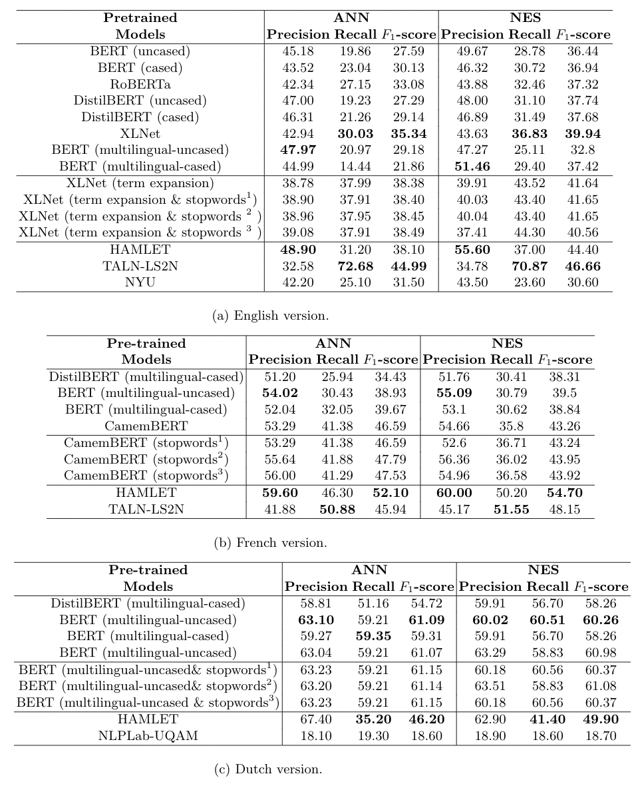

# Terminology Extraction

We experiment with different Transformer-based pre-trained language models for the terminology extraction task, namely XLNet, BERT, DistilBERT, and RoBERTa, with additional techniques, including class weighting in order to reduce the significant imbalance in the training data, as well as rule-based term expansion and filtering. Our experiments are conducted on the ACTER dataset covering 3 languages and 3 domains. The results prove to be competitive on English and French, and the proposed approach outperforms the state of the art (SOTA) on Dutch.

## 1. ACTER 

The dataset structure as well as the distributions of terms per domain per language are demonstrated in [data.exploration.ipynb](./eda/data_exporation.ipynb)

---

## 2. Models and Architecture

### 2.1 Models 

For each language, we examine several pretrained language models using SimpleTransformers as the following table. 

| Model | English dataset | French dataset | Dutch dataset | 
| - | - | - | - |
|Multilingual BERT (uncased)|x|x|x|
|Multilingual BERT (cased)|x|x|x|
|Monolingual English BERT (uncased)|x|||
|Monolingual English BERT (cased)|x|||
|RoBERTa |x|||
|DistilBERT (uncased)|x||| 
|DistilBERT (cased)|x||| 
|Multilingual DistilBERT (cased)|||x|
|XLNet  |x|||
|CamemBERT||x||

### 2.2 Architecture 

The worflow of our implementation:

The code insides [`./core_model/`](./core_model/) is an example of how we implemented on French dataset on CamemBERT. Preferable to run on Google Collab to take advantage of GPU (in case your local machine does not support).

---

## 3. Results

All the saved prediction results of mentionned pretrained models on 3 languages are saved in folder [`./results/weighted_results/`](./results/weighted_results/).

---

## 4. References
- [Shared Task on Automatic Term Extraction Using the
Annotated Corpora for Term Extraction Research (ACTER) Dataset](https://www.aclweb.org/anthology/2020.computerm-1.12.pdf).
- [TALN-LS2N System for Automatic Term Extraction](https://www.aclweb.org/anthology/2020.computerm-1.13.pdf).

---

## Contributors:
- 🐮 [TRAN Thi Hong Hanh](https://github.com/honghanhh) 🐮
- Prof. [Senja POLLAK](https://github.com/senjapollak)
- Prof. [Antoine DOUCET](https://github.com/antoinedoucet)
- Prof. [Matej MARTINC](https://github.com/matejMartinc)
- Prof. [Andraž REPAR](https://github.com/andrazrepar)